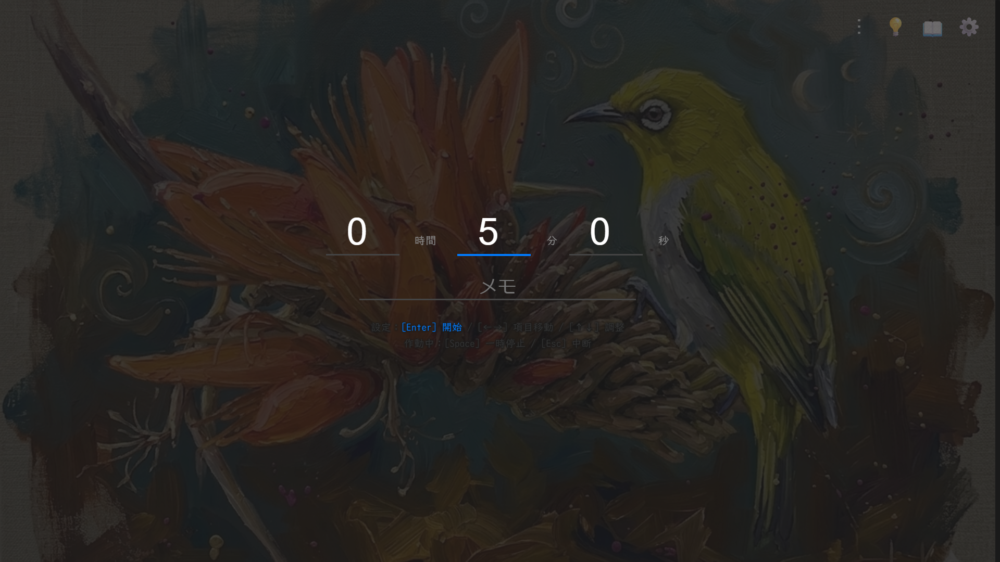
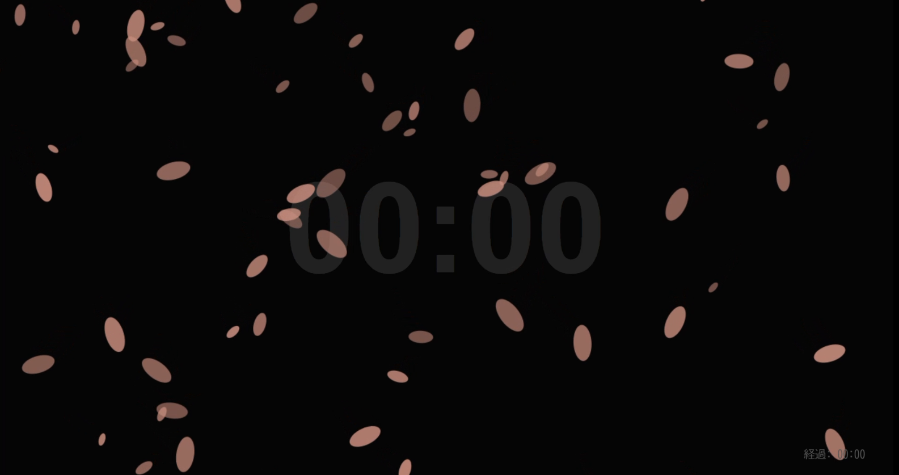
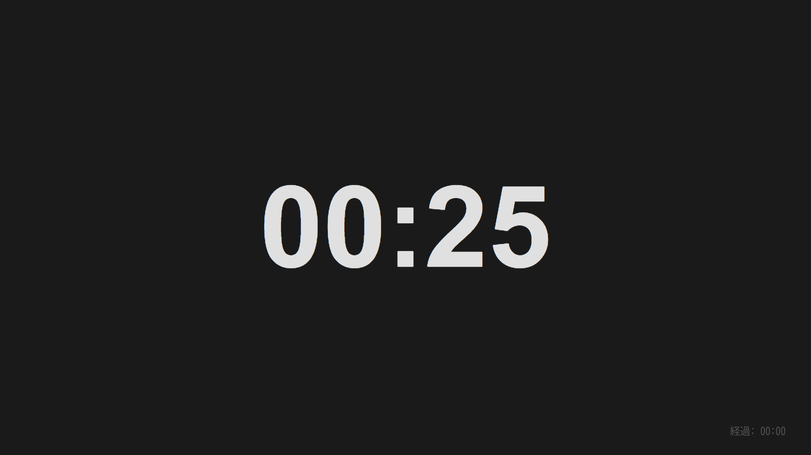

# 勉強タイマー ｜ 作業・勉強を効率化する集中ツール

ブラウザで動くシンプルで洗練されたタイマーです。
最小の操作で素早く作業に取り掛かれます。履歴管理で振り返りが可能で、あなたの作業や勉強の効率を最大化します。

<table>
  <tr>
    <td></td>
    <td></td>
    <td></td>
  </tr>

##  サイトURL
[https://focus-timer-pro.com](https://focus-timer-pro.com)

##  特徴
- **フルスクリーン対応**:  没入感のある表示で、余計な情報を遮断して作業に没頭できます。
- **洗練されたデザイン**:  集中状態を邪魔しない、ダークモードを基調としたUIデザイン。
- **勉強・仕事に最適**:  デフォルトの時間はポモドーロ・テクニックを意識した「25分」に設計しています。
- **カスタマイズ可能なテーマ**:  気分に合わせて配色を変更可能。
- **履歴管理機能**:  毎日の作業ログを自動保存。振り返りに役立ててください。
- **完全無料**:  全ての機能を無料でご利用いただけます。

##  使い方
1. Enterキーの入力で、”即” 作業を開始しましょう!
2. スペースキーで一時停止・再開
3. タイマー終了後もストップウォッチは動いています。気の済むまであなたの作業を続けられます。
4. 休憩をとったあとも "即" 作業を再開できます。（設定パネルから、デフォルトの作業時間は変更可能）
5. 履歴（ログ）画面で、これまでの頑張りを確認できます。

##  検索キーワード
タイマー, フルスクリーン, 勉強, 作業用, ポモドーロ, 集中, 無料ツール, 効率化, タイム管理

##  プライバシーについて
当ツールはユーザーの作業ログをブラウザのローカルストレージにのみ保存します。サーバーに個人情報を送信・蓄積することはありません。

##  免責事項
当サイトの利用により生じた損害について、開発者は一切の責任を負いません。

##  ライセンス
このプロジェクトは [MITライセンス](./LICENSE) のもとで公開されています。
